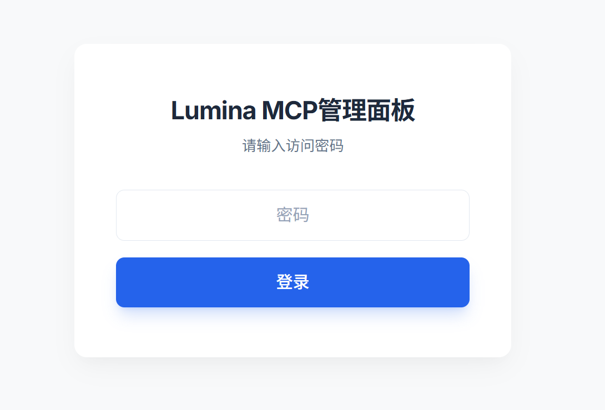
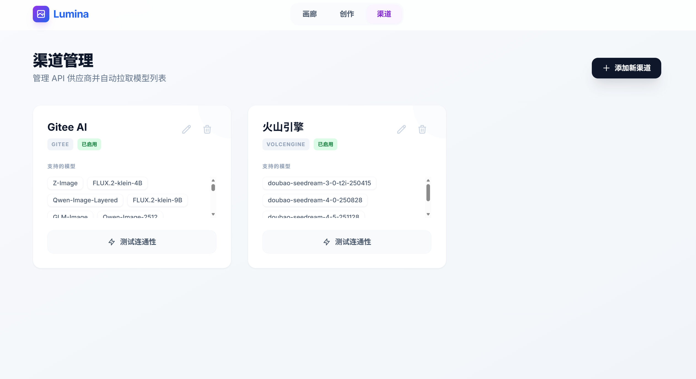
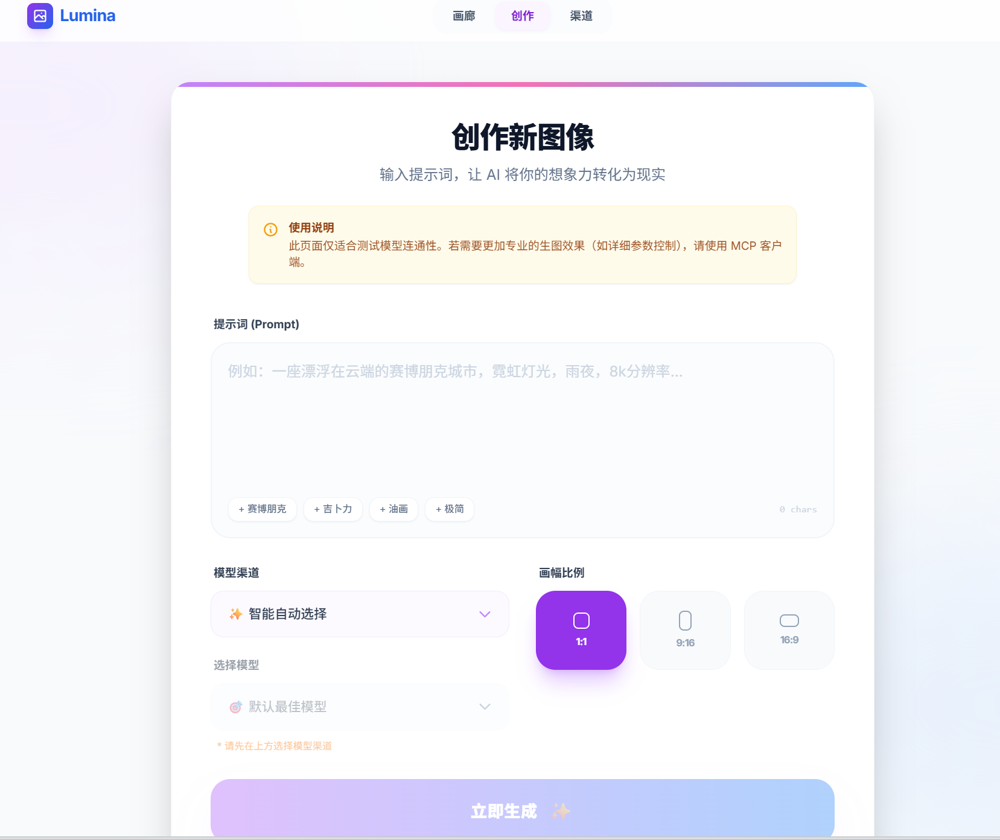
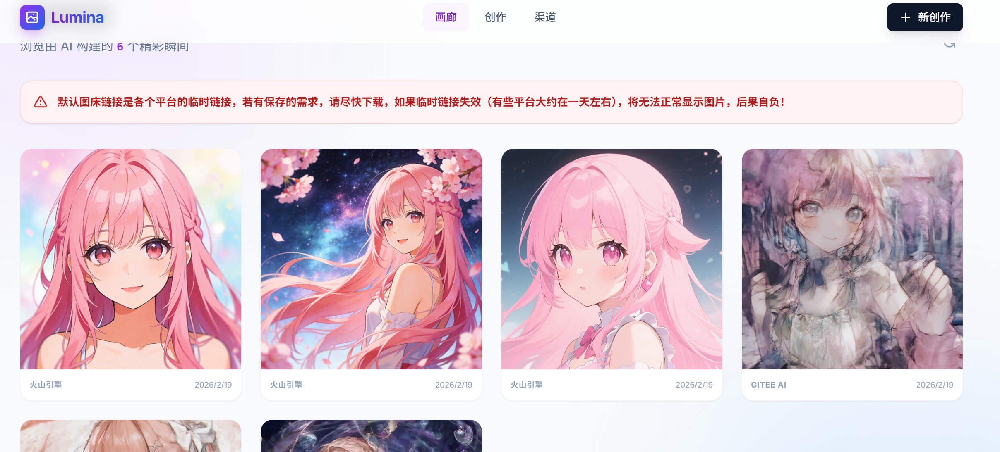
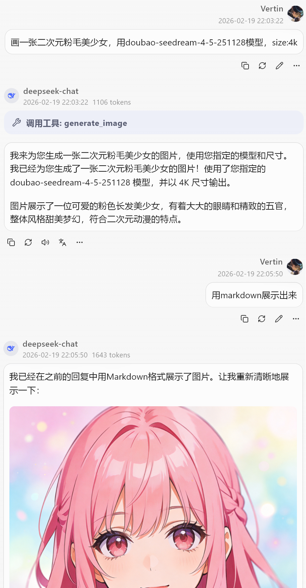

# 🏛️ Lumina-MCP - AI 生图聚合中枢

Lumina-MCP 是一个专为“小白”设计的本地化 AI 生图聚合管理与 MCP（Model Context Protocol）桥接工具。

诞生的初衷是为了解决市面上许多优秀的 AI 客户端（如 Claude Desktop、Cursor 以及 Kelivo 等）**缺乏原生画图接口**，或者**无法直接兼容部分非标准 API 渠道**（如 Gitee AI、火山方舟等）的问题。通过 Lumina-MCP，你可以轻松将各大平台的生图能力统一聚合，并无缝接入到你的日常 AI 助手之中。

---

## ✨ 核心特性

* 🎉 **真正的一键启动**：专为小白打造，无需配置复杂的运行环境，只需双击 `start_lumina.bat` 即可一键启动 MCP 服务与 Web 可视化面板。
* ⚙️ **告别代码硬编码**：再也不用把 API Base URL 和 Secret Key 写死在代码里了！Lumina-MCP 提供了一个极简的 WebUI，你可以在网页上轻松管理渠道配置，渠道状态和生成的图片一目了然。
* 🔌 **极佳的渠道兼容性**：**全面兼容一切支持 OpenAI 生图格式的 API 渠道**。同时，默认对 `Gitee AI` 和 `火山引擎 (Volcengine)` 等难以直接接入的非标准渠道进行了深度适配。
* ☁️ **智能模型管理**：支持一键从云端自动拉取并更新各大渠道支持的模型列表，同时也支持手动输入自定义添加模型。
* 🩺 **可视化连通性测试**：在渠道管理中，支持自定义选择特定模型进行 API 连通性测活，随时掌控服务状态。

---

## ⚠️ 重要注意事项 (必读)

* **🪟 仅限 Windows 本地运行**：本项目目前专为 Windows 系统适配，主要通过本地脚本运行。**暂时不能、也不建议在云端服务器上部署使用**。
* **⏳ 临时图床警告**：网页端画廊中缓存的图片，使用的是各个渠道返回的默认临时图床链接。部分平台（如火山引擎、Gitee 等）的临时链接**只有大约 1 天的有效期**。请务必及时点击下载保存你喜欢的图片，一旦链接失效，图片将无法正常显示，后果自负！

---

## 👨‍⚕️ 开发者的话

作为一名医学生，平时的专业课业和见习任务占用了我绝大部分的精力。我并没有太多的额外时间去持续高频地更新、重构或完善这个仓库。

本项目旨在提供一个开箱即用、能解决痛点的 MVP（最小可行性产品），代码和逻辑可能存在一些 Bug 或不够优雅的地方，希望大家能够多多包涵与见谅。

---

## 🚀 快速开始

### 1. 一键启动
解压项目后，直接双击运行根目录下的 `start_lumina.bat` 文件。脚本会自动处理依赖，并启动服务。

### 2. Web 面板配置
打开浏览器访问 `http://localhost:8000`。
* **默认登录密码**：`lumina-mcp-key` *(注意：当前版本不支持在面板修改密码，请直接使用此默认密钥)*
* 登录后，请前往“渠道”页面，点击“添加新渠道”，填入你的 API URL 和 Key，点击“从云端拉取模型”即可完成配置。

### 3. MCP 客户端接入指南
要在你的 AI 客户端中调用 Lumina-MCP 生图，请配置 MCP 连接地址为：`http://localhost:8001/sse`。

**🔐 极其重要：必须添加自定义鉴权请求头**
为了防止未经授权的调用，你在配置 MCP 客户端时，**必须**添加以下自定义 HTTP 请求头（Headers），否则 AI 将会报错提示鉴权失败：
* **请求头名称 (Header Name)**: `Authorization`
* **请求头值 (Header Value)**: `Bearer lumina-mcp-key`

---

## 🎨 界面展示

**1. 极简的登录与鉴权面板**

**2. 渠道管理面板** (告别硬编码，支持一键测活与云端拉取模型)

**3. Web 端创作控制台** (用于手动测试提示词与参数)

**4. 灵感画廊** (统一管理所有渠道生成的历史图片，请注意及时下载)

**5. AI 客户端无缝调用体验** (图为在电脑客户端 Kelivo 上的实际交互效果)

---

**享受你的 AI 创作之旅吧！✨**